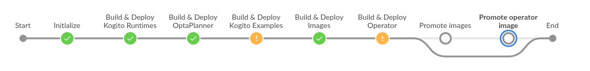
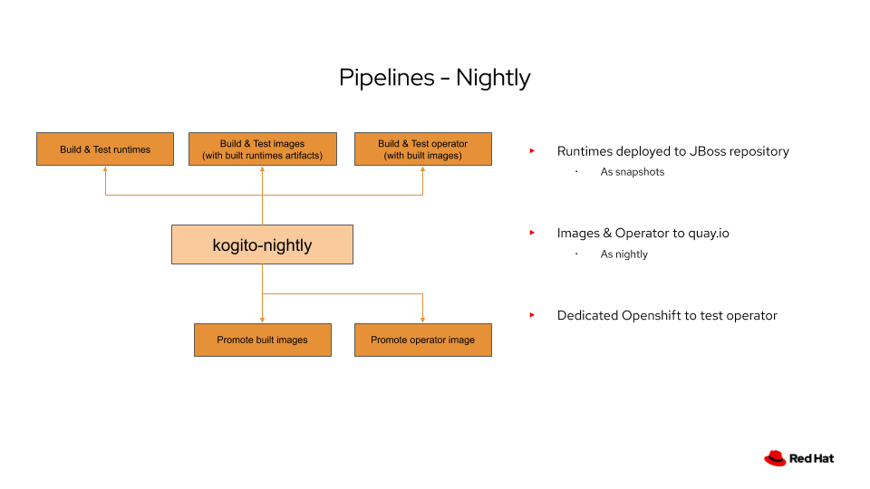
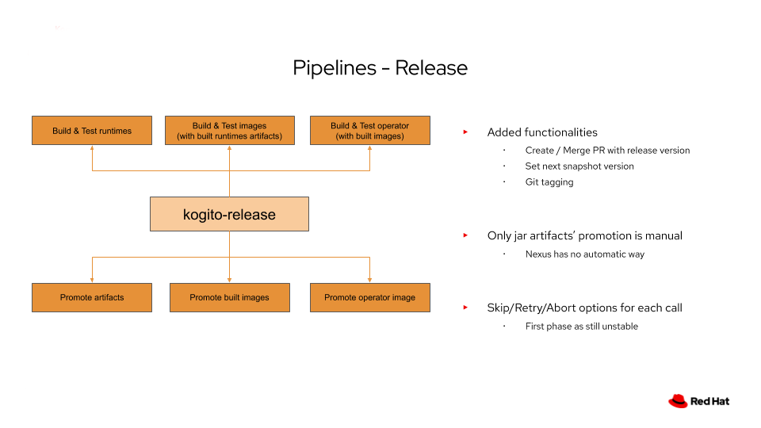

# Nightly & Release pipelines

* [Nightly & Release pipelines](#nightly--release-pipelines)
  * [Nightly pipeline](#nightly-pipeline)
    * [Nightly pipeline Architecture](#nightly-pipeline-architecture)
    * [Activate/Deactivate release branch](#activatedeactivate-release-branch)
    * [Nightly pipeline Parameters](#nightly-pipeline-parameters)
    * [Nightly pipeline Troubleshooting](#nightly-pipeline-troubleshooting)
      * [Nightly pipeline is failing](#nightly-pipeline-is-failing)
      * [Nightly pipeline is unstable](#nightly-pipeline-is-unstable)
      * [Nightly Build & Deploy job is failing](#nightly-build--deploy-job-is-failing)
      * [Nightly Promote job is failing](#nightly-promote-job-is-failing)
    * [Testing the Nightly Pipeline](#testing-the-nightly-pipeline)
      * [Create specific Maven repository for nightly testing](#create-specific-maven-repository-for-nightly-testing)
      * [Change pipeline envs for nightly testing](#change-pipeline-envs-for-nightly-testing)
      * [Setup Jenkins job(s) for nightly testing](#setup-jenkins-jobs-for-nightly-testing)
      * [Setup Jenkins creds for nightly testing](#setup-jenkins-creds-for-nightly-testing)
      * [Launch a nightly with minimal parameters for nightly testing](#launch-a-nightly-with-minimal-parameters-for-nightly-testing)
  * [Release pipeline](#release-pipeline)
    * [Architecture of the Release pipeline](#architecture-of-the-release-pipeline)
    * [Before the Release Pipeline is started](#before-the-release-pipeline-is-started)
      * [JIRA issues creation](#jira-issues-creation)
    * [Release pipeline parameters](#release-pipeline-parameters)
      * [Minimal parameters for the release](#minimal-parameters-for-the-release)
      * [Start Release Pipeline with specific parameters](#start-release-pipeline-with-specific-parameters)
    * [Release pipeline Manual interventions](#release-pipeline-manual-interventions)
      * [Default manual interventions](#default-manual-interventions)
      * [Retry/Skip/Abort manual intervention](#retryskipabort-manual-intervention)
    * [After the Release Pipeline is finished](#after-the-release-pipeline-is-finished)
      * [Operator Crd/Csv files](#operator-crdcsv-files)
      * [Docs release](#docs-release)
      * [Update the JIRAs](#update-the-jiras)
      * [Update nightly jobs with new release branch](#update-nightly-jobs-with-new-release-branch)
    * [Release pipeline Troubleshooting](#release-pipeline-troubleshooting)
      * [Release pipeline is failing](#release-pipeline-is-failing)
      * [Release pipeline is reporting a called *-deploy job is failing](#release-pipeline-is-reporting-a-called--deploy-job-is-failing)
      * [Release pipeline is reporting a called *-promote job is failing](#release-pipeline-is-reporting-a-called--promote-job-is-failing)
    * [Testing the Release Pipeline](#testing-the-release-pipeline)
      * [Create specific Maven repository for release testing](#create-specific-maven-repository-for-release-testing)
      * [Change pipeline envs for release testing](#change-pipeline-envs-for-release-testing)
      * [Setup Jenkins job(s) for release testing](#setup-jenkins-jobs-for-release-testing)
      * [Setup Jenkins creds for release testing](#setup-jenkins-creds-for-release-testing)
      * [Use specific nexus for released artifacts](#use-specific-nexus-for-released-artifacts)
      * [Launch a release with minimal parameters for testing](#launch-a-release-with-minimal-parameters-for-testing)
  * [Explanation on architecture of those pipelines](#explanation-on-architecture-of-those-pipelines)
    * [Background & Objectives](#background--objectives)
    * [Problems / Solutions](#problems--solutions)
      * [Problems](#problems)
      * [Solution](#solution)
    * [Nightly pipeline Proposal](#nightly-pipeline-proposal)
    * [Release pipeline Proposal](#release-pipeline-proposal)

In order to perform, Nightly and Release pipelines need to call some deploy and promote jobs for runtimes, images and operator.  
Those jobs should be present at the same level as the nightly and/or release job, so they can be found when called.

Here is the list of jobs and link to Jenkinsfiles:

* [kogito-runtimes-deploy](https://github.com/kiegroup/kogito-runtimes/blob/master/Jenkinsfile.deploy)
* [kogito-runtimes-promote](https://github.com/kiegroup/kogito-runtimes/blob/master/Jenkinsfile.promote)
* [kogito-images-deploy](https://github.com/kiegroup/kogito-images/blob/master/Jenkinsfile.deploy)
* [kogito-images-promote](https://github.com/kiegroup/kogito-images/blob/master/Jenkinsfile.promote)
* [kogito-operator-deploy](https://github.com/kiegroup/kogito-cloud-operator/blob/master/Jenkinsfile.deploy)
* [kogito-operator-promote](https://github.com/kiegroup/kogito-cloud-operator/blob/master/Jenkinsfile.promote)

## Nightly pipeline

### Nightly pipeline Architecture

The Nightly Pipeline is composed of many steps, calling different other jobs to perform the build&test of runtimes/images/operator as well as the deployment of jar artifacts and nightly container images.

**NOTE:** The Nightly Pipeline is a multibranch pipeline job and runs on `master` and each active release branch (for example 0.15.x).

Steps could be separated into 2 parts:

* **Build & Deploy**  
  Composed of calls to `*-deploy` jobs, is reponsible to runtimes, images and operator are ok.  
  Note that if any problem happens in a `deploy` job, then other deploy jobs are still run (they will take the previous stable artifacts/images) to run.
* **Promote**  
  Composed of calls to `*-promote` jobs, is responsible to deploy snapshots artifacts/nightly images to repositories/registries.

Note that for a particular part of the project (runtimes, images or operator), if the `Build & Deploy` failed, then the `Promote` part is skipped.

### Activate/Deactivate release branch

Once a branch is created or another one should be deactivated, you just need to go the configuration of the [nightly job](https://rhba-jenkins.rhev-ci-vms.eng.rdu2.redhat.com/job/KIE/job/kogito/job/kogito-nightly/configure) and change the `include` or `exclude` configuration of Git.

*TIP: just mention the branches you need in `include` part and leave the `exclude` part empty.*

### Nightly pipeline Parameters

If needed, the Nightly pipeline can be restarted with `SKIP_TESTS` or `SKIP` specific part options.  
See the [Nightly Jenkinsfile](../Jenkinsfile.nightly) for more information on parameters.

### Nightly pipeline Troubleshooting

Here are some information in case the Nightly pipeline fails ...

In the Zulip kogito-ci stream, there should be a link to the failing job. Open it and then open the `Blue Ocean` view. This will be easier to detect what is failing.

#### Nightly pipeline is failing

In case the main pipeline is failing, this will be most likely a Groovy error.  
This can happen when changes have been made to the [Nightly Jenkinsfile](../Jenkinsfile.nightly).

The problem will need to be corrected on the corresponding branch and the pipeline could be restarted.

#### Nightly pipeline is unstable

This usually means that one or many of the called jobs is/are failing. List of unsuccessful jobs should be displayed into Zulip and can be reviewed into the Blue Ocean.

By clicking the failing stage and accessing the failing job, you should be able to review the problem.

#### Nightly Build & Deploy job is failing

In that case, identify the error (Groovy script error or test problem), correct it and relaunch the Nightly Pipeline if necessary.

Here are some problems which can occur on a `Build & Deploy` job:

* Groovy script error (Jenkinsfile.deploy has some problems)
* Compilation
* Test errors
* Deployment problem (credentials)

#### Nightly Promote job is failing

In that case, identify the error (Groovy script error or test problem), correct it and rebuild the failing job.

Here are some problems which can occur on a `Promote` job:

* Groovy script error (Jenkinsfile.deploy has some problems)
* Deployment problem (credentials)

### Testing the Nightly Pipeline

In order to test the full Nightly Pipeline, and in order to avoid any problem, you will need to change some env in [Jenkinsfile.nightly](../Jenkinsfile.nightly), create jobs in Jenkins and setup some credentials.

* Have a specific container registry and credentials registered with `push` rights on it
* Have a specific Maven repository to deploy jar artifacts

#### Create specific Maven repository for nightly testing

For deploying runtimes artifacts, and to avoid any conflict with main repository on snapshot artifacts, you will need to provide a nexus repository to deploy the artifacts.

If don't have one already, you can create one with the [nexus-operator](https://github.com/m88i/nexus-operator).

**IMPORTANT:** We don't support yet specific user's repository. Anonymous user needs to have push rights to it.

#### Change pipeline envs for nightly testing

* `IMAGE_NAMESPACE` (and `IMAGE_REGISTRY_CREDENTIALS`, see [Setup Jenkins creds](#setup-jenkins-creds-for-nightly-testing))

#### Setup Jenkins job(s) for nightly testing

You will need to create single pipeline jobs and let them run once to update the `parameters` part (you should stop them quickly as it makes no sense to let them run until the end. Just wait for the checkout of repo and the `node` command done).

**NOTE:** You will need to access the correct branch for each of them!

* [kogito-runtimes-deploy](https://github.com/kiegroup/kogito-runtimes/blob/master/Jenkinsfile.deploy)
* [kogito-runtimes-promote](https://github.com/kiegroup/kogito-runtimes/blob/master/Jenkinsfile.promote)
* [kogito-images-deploy](https://github.com/kiegroup/kogito-images/blob/master/Jenkinsfile.deploy)
* [kogito-images-promote](https://github.com/kiegroup/kogito-images/blob/master/Jenkinsfile.promote)
* [kogito-operator-deploy](https://github.com/kiegroup/kogito-cloud-operator/blob/master/Jenkinsfile.deploy)
* [kogito-operator-promote](https://github.com/kiegroup/kogito-cloud-operator/blob/master/Jenkinsfile.promote)

**NOTE:** Deploy & Promote jobs of a specific repository can be ignored (and so job does not need to be created for testing), but you will need to check the corresponding `SKIP_` parameter.

#### Setup Jenkins creds for nightly testing

In Jenkins, you should set those credentials and set the correct values in env:

* `IMAGE_REGISTRY_CREDENTIALS` (username/password credential)  
  Credential to push image to the container registry (should have rights to `IMAGE_NAMESPACE`)
* `KOGITO_CI_EMAIL_TO` (secret text credential)  
  Email for notifications. You can set your email for example

#### Launch a nightly with minimal parameters for nightly testing

* `ARTIFACTS_REPOSITORY` to set to the correct repository
* (optional) `SKIP_TESTS` (usually you will want that)
* (optional) `SKIP_*` to skip different phases

## Release pipeline

### Architecture of the Release pipeline

The Release Pipeline is composed of many steps, calling different other jobs to set the correct version, perform the build&test of runtimes/images/operator and then promote released artifacts and container images as production ready.

Like the Nightly Pipeline, steps could be separated into 2 parts: `Build & Deploy` and `Promote`.

The Release Pipeline is also adding extra functionalities to this:

* **[Create release branches](../Jenkinsfile.create-release-branches)**  
  Based on the given version, a new release branch (with `Major.minor.x`) is created if not already existing.
* **Create PRs**  
  In the `Build & Deploy` phase, the different `Build & Deploy` jobs will create PR(s) with version changes on the release branch of the different repositories.
* **Merge PRs**  
  In the `Promote` phase, PRs create are merged by the different `Promote` jobs.
* **Set next snapshot**  
  For some of the repositories, it will also PR create&merge to update to the next "snapshot" on the release branch.

### Before the Release Pipeline is started

#### JIRA issues creation

Before starting the pipeline, please create the issues for the different components of the pipeline:

* Core
* Image
* Operator
* Optaplanner

**NOTE:** There is, for now, no automatic creation/update of JIRA issues into the pipeline. This has to be done manually...

### Release pipeline parameters

#### Minimal parameters for the release

In order to start, here are the minimal parameters to the Release Pipeline:

* **PROJECT_VERSION**  
  Corresponds to the Kogito version to be set during the release.
* **DEPLOY_AS_LATEST**
  Should be set to true if we want the container images to be tagged as `latest`.

#### Start Release Pipeline with specific parameters

The Release pipeline can be tweaked with some other parameters if needed.

One option is the possibility to skip some stages, depending on which part you want to release.  
**NOTE: If you decide to skip the runtimes part, please be careful on `ARTIFACTS_REPOSITORY`, `EXAMPLES_URI` and `EXAMPLES_REF` parameters**

See [Release Jenkinsfile](../Jenkinsfile.release) for the full list on parameters.

### Release pipeline Manual interventions

#### Default manual interventions

One other specificity of the Release Pipeline are the manual interventions.  
They are currently 3 of them:

* **Get staging repository** (happens in kogito-runtimes-deploy)  
  When asked, Staging repository can be retrieved from [JBoss Nexus repository](https://repository.jboss.org/nexus/). For that, the user needs to have specific rights or ask someone who has those rights.  
  Once retrieved, you can put the url to staging repository into the input asking for it on Jenkins.
* **Release staging repository to Maven Central** (happens in kogito-runtimes-deploy)  
  Same as getting staging repository, you need the rights to release the artifacts from the staging repository in [JBoss Nexus repository](https://repository.jboss.org/nexus/) to Maven Central, or ask someone with rights to do it.  
  Once artifacts are released, just confirm it is released on Jenkins.
* **Check kogito-apps artifacts are set to correct url** (happens in kogito-images-promote)
  Jenkins will ask you to review the logs of this job and check urls are correct in the different displayed `module.yaml` files.  
  Review them and confirm if everything is ok.

#### Retry/Skip/Abort manual intervention

For each called jobs, in case of failure, there is retry/skip/abort manual intervention.

* **Retry**  
  will completely relaunch the job, taking latest changes on the branch (test or groovy correction).
* **Skip**  
  if you think the test failed because of random error but it is ok (can happen for BDD tests where trying again will pass the test, due to instability of Openshift ...).
* **Abort**  
  if any other problem.  
  As long as `promote` phase did not start, there will be no impact on the release.

### After the Release Pipeline is finished

Once the Release Pipeline is finished, there are some actions to be done:

#### Operator Crd/Csv files

Once the operator's release has been done, it created new csv and crd files under `deploy/olm-catalog/kogito-operator/{VERSION}` on the release branch in [kogito-cloud-operator](https://github.com/kiegroup/kogito-cloud-operator).
You will need to create, with those files, new OperatorHub PRs (one for Openshift and one for Kubernetes) or asked someone from Cloud part to do it.

If there is any change to be done due to PRs, do it on the release branch.

**After Operatorhub PRs are merged**, you will need to transfer those crd and csv files to the `master` branch, as we want all crd/csv files history on master, for future releases.  
Do not panic, there is a simple [job](https://rhba-jenkins.rhev-ci-vms.eng.rdu2.redhat.com/job/KIE/job/kogito/job/tools/job/kogito-operator-copy-manifests-files/) for that, with an associated [Jenkinsfile](https://github.com/kiegroup/kogito-cloud-operator/blob/master/Jenkinsfile.copy_csv_files).

#### Docs release

Once pipeline is finished, you need to release docs. For that, please ask on Zulip for anybody with rights to do it.

#### Update the JIRAs

You can now close the different JIRA issues regarding the release.

#### Update nightly jobs with new release branch

In case a new release branch has been created, you will need to update the different jobs's configuration with the new branch name.  
You will just need to update the `include` part of the Git configuration of the jobs.

Here are some of the jobs to update (this is not exhaustive):

* [kogito-nightly](https://rhba-jenkins.rhev-ci-vms.eng.rdu2.redhat.com/job/KIE/job/kogito/job/kogito-nightly/)
* [kogito-runtimes-sonarcloud](https://rhba-jenkins.rhev-ci-vms.eng.rdu2.redhat.com/job/KIE/job/kogito/job/kogito-runtimes-sonarcloud/)
* [kogito-apps-sonarcloud](https://rhba-jenkins.rhev-ci-vms.eng.rdu2.redhat.com/job/KIE/job/kogito/job/kogito-apps-sonarcloud/)

### Release pipeline Troubleshooting

Here are some information in case the Nightly pipeline fails ...

In the Zulip kogito-ci stream, there should be a link to the failing job. Open it and then open the `Blue Ocean` view. This will be easier to detect what is failing.

#### Release pipeline is failing

In case the main pipeline is failing, this will be most likely a Groovy error.  
This can happen when changes have been made to the [Release Jenkinsfile](../Jenkinsfile.release).

The problem will need to be corrected on `master` and the pipeline could be restarted.

#### Release pipeline is reporting a called *-deploy job is failing

In that case, identify the error (Groovy script error or test problem), correct it and relaunch the Nightly pipeline if necessary.

If the problem is a test error, check the errors and then decide to retry or skip the called job (see [retry possibility](#retryskipabort-manual-intervention)).

If the problem in `Build & Deploy` job is one of those:

* Groovy script error (Jenkinsfile.deploy has some problems)
* Compilation error
* Create PR or deployment problem (credentials)

You can correct it, and then just retry the job (see [retry possibility](#retryskipabort-manual-intervention))

#### Release pipeline is reporting a called *-promote job is failing

In that case, identify the error (Groovy script error or test problem), correct it and rebuild the failing job.

Here are some problems which can occur on a `Promote` job:

* Groovy script error (Jenkinsfile.deploy has some problems)
* Merge PR (on set release version PR) or Deployment problem (credentials)

You can correct it, and then just retry the job (see [retry possibility](#retryskipabort-manual-intervention))

**WARNING:**  
**If the problem occurs during a `set next snapshot` stage, then you should not retry the job. If that happens, that means that "release" steps have been done. So just skip the job and set the next snapshot manually in the repository on the corresponding release branch**

### Testing the Release Pipeline

In order to test the full Release Pipeline, and in order to avoid any problem, you will need to change some env in [Jenkinsfile.release](../Jenkinsfile.release), create jobs in Jenkins and setup some credentials.

* Have a specific container registry and credentials registered with `push` rights on it
* Have a specific author repository that you can test against
* If you don't want to flood your test author repository with temporary branches, you should use also another author, referred as "bot account", and that you can setup in environment variables `BOT_*`
* Have a specific Maven repository to deploy jar artifacts

#### Create specific Maven repository for release testing

For deploying runtimes artifacts, and to avoid any conflict by creating a staging repository inadvertly, you will need to provide a nexus repository to deploy the artifacts.

If don't have one already, you can create one with the [nexus-operator](https://github.com/m88i/nexus-operator).

**IMPORTANT:** We don't support yet specific user's repository. Anonymous user needs to have push rights to it.

#### Change pipeline envs for release testing

* `GIT_AUTHOR` (and `GIT_AUTHOR_CREDS_ID`, see [Setup Jenkins creds](#setup-jenkins-creds-for-release-testing))
* `BOT_AUTHOR` (and `BOT_AUTHOR_CREDS_ID`, see [Setup Jenkins creds](#setup-jenkins-creds-for-release-testing))
* `IMAGE_NAMESPACE` (and `IMAGE_REGISTRY_CREDENTIALS`, see [Setup Jenkins creds](#setup-jenkins-creds-for-release-testing))

#### Setup Jenkins job(s) for release testing

You will need to create single pipeline jobs and let them run once to update the `parameters` part (you should stop them quickly as it makes no sense to let them run until the end. Just wait for the checkout of repo and the `node` command done).

**NOTE:** You will need to access the correct branch for each !

* [kogito-release](../Jenkinsfile.release)
* [create-release-branches](../Jenkinsfile.create-release-branches)
* [kogito-runtimes-deploy](https://github.com/kiegroup/kogito-runtimes/blob/master/Jenkinsfile.deploy)
* [kogito-runtimes-promote](https://github.com/kiegroup/kogito-runtimes/blob/master/Jenkinsfile.promote)
* [kogito-images-deploy](https://github.com/kiegroup/kogito-images/blob/master/Jenkinsfile.deploy)
* [kogito-images-promote](https://github.com/kiegroup/kogito-images/blob/master/Jenkinsfile.promote)
* [kogito-operator-deploy](https://github.com/kiegroup/kogito-cloud-operator/blob/master/Jenkinsfile.deploy)
* [kogito-operator-promote](https://github.com/kiegroup/kogito-cloud-operator/blob/master/Jenkinsfile.promote)

**NOTE:** Deploy & Promote jobs of a specific repository can be ignored (and so job does not need to be created for testing), but you will need to check the corresponding `SKIP_` parameter.

#### Setup Jenkins creds for release testing

In Jenkins, you should set those credentials and set the correct values in env:

* `GIT_AUTHOR_CREDS_ID` (username/password credential)  
  Username / [GitHub token](https://github.com/settings/tokens) which has rights on `GIT_AUTHOR`
* `BOT_AUTHOR_CREDS_ID` (username/password credential)  
  Username / [GitHub token](https://github.com/settings/tokens) which has rights on `BOT_AUTHOR`
* `GITHUB_TOKEN_CREDS_ID` (secret text credential)  
  [GitHub token](https://github.com/settings/tokens) for Github CLI
* `IMAGE_REGISTRY_CREDENTIALS` (username/password credential)  
  Credential to push image to the container registry (should have rights to `IMAGE_NAMESPACE`)
* `KOGITO_CI_EMAIL_TO` (secret text credential)  
  Email for notifications. You can set your email for example

#### Use specific nexus for released artifacts

In case staging and release repositories are the same for testing, you can uncomment the line `addStringParam(buildParams, 'MAVEN_ARTIFACT_REPOSITORY', env.STAGING_REPOSITORY)` in `Promote images` stage. This is made to make the called job aware of the release repository to update correctly the artifacts.

#### Launch a release with minimal parameters for testing

* `PROJECT_VERSION`
* `ARTIFACTS_REPOSITORY` to set to the correct repository
* (optional) `SKIP_TESTS` (usually you will want that)
* (optional) `SKIP_*` to skip different phases

## Explanation on architecture of those pipelines

### Background & Objectives

The Kogito project is composed of 3 parts:

* Runtimes (kogito-runtimes, kogito-apps, kogito-examples)

  * Jar artifacts
  * Deployed to Maven repository

* Images (kogito-images)

  * Cekit (docker) build
  * Deployed to Quay

* Operator (kogito-cloud-operator)

  * Go / OperatorSDK
  * Deployed to Quay

The objectives are:

* Unify deployment process from runtimes to operator
* Avoid human interaction
* Reuse processes

### Problems / Solutions

#### Problems

* Need runtimes’ artifacts to test images & operator
* Different technologies (Java, Cekit/Docker, Go)
* High-level tests are done in BDD tests (operator)

#### Solution

* Main pipeline to control the flow
* Separate build&tests and promote
* Promote is done only when all tests in all repositories are ok
* Each “repo” keeps its own deployment/promote process

### Nightly pipeline Proposal

The [Nightly pipeline](../Jenkinsfile.nightly) for Kogito is responsible to build&test runtimes artifacts, images and operator.  
For that, it will call different jobs for deployment and then for promote if all tests passed.  

If the pipeline is failing or is unstable, then a notification is sent to Zulip.

### Release pipeline Proposal

The [Release Pipeline](../Jenkinsfile.release) aims to enhance the Nightly Pipeline by providing added features like `set version`, `create/merge PRs`, `git tag`...

Some steps are still manual (like jar artifacts promotion to Maven Central) and notifications are sent to Zulip for manual intervention.
