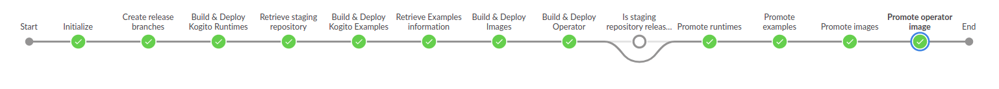

# Release Pipeline

- [Release Pipeline](#release-pipeline)
  - [Release process](#release-process)
    - [Create a release branch](#create-a-release-branch)
      - [How to create a new release branch ?](#how-to-create-a-new-release-branch-)
      - [Remove release branch jobs](#remove-release-branch-jobs)
    - [Performing a release](#performing-a-release)
      - [Before the Release Pipeline is started](#before-the-release-pipeline-is-started)
        - [JIRA issues creation](#jira-issues-creation)
      - [Where is the main release pipeline job](#where-is-the-main-release-pipeline-job)
      - [Release pipeline parameters](#release-pipeline-parameters)
        - [Minimal parameters for the release](#minimal-parameters-for-the-release)
        - [Start Release Pipeline with specific parameters](#start-release-pipeline-with-specific-parameters)
      - [Release pipeline Manual interventions](#release-pipeline-manual-interventions)
        - [Default manual interventions](#default-manual-interventions)
        - [Retry/Continue/Skip/Abort manual intervention](#retrycontinueskipabort-manual-intervention)
      - [After the Release Pipeline is finished](#after-the-release-pipeline-is-finished)
        - [Operator Crd/Csv files](#operator-crdcsv-files)
        - [Docs release](#docs-release)
        - [Update the JIRAs](#update-the-jiras)
  - [Use cases](#use-cases)
    - [Deploy on artifacts](#deploy-on-artifacts)
    - [Deploy only Cloud images / Operator](#deploy-only-cloud-images--operator)
    - [Artifacts version is different from Cloud version](#artifacts-version-is-different-from-cloud-version)
  - [Architecture of the Release pipeline](#architecture-of-the-release-pipeline)
  - [Release pipeline Troubleshooting](#release-pipeline-troubleshooting)
    - [Release pipeline is failing](#release-pipeline-is-failing)
    - [Release pipeline is reporting a called \*-deploy job is failing](#release-pipeline-is-reporting-a-called--deploy-job-is-failing)
    - [Release pipeline is reporting a called \*-promote job is failing](#release-pipeline-is-reporting-a-called--promote-job-is-failing)
  - [Testing the Release Pipeline](#testing-the-release-pipeline)
    - [Create specific Maven repository for release testing](#create-specific-maven-repository-for-release-testing)
    - [Create the different Jenkins jobs for release testing](#create-the-different-jenkins-jobs-for-release-testing)
    - [Launch a release with minimal parameters for testing](#launch-a-release-with-minimal-parameters-for-testing)

In order to perform, Nightly and Release pipelines need to call some deploy and promote jobs for runtimes, examples, images and operator.  
Those jobs should be present at the same level as the nightly and/or release job, so they can be found when called.

Here is the list of jobs and link to Jenkinsfiles:

* [kogito-runtimes-deploy](https://github.com/kiegroup/kogito-runtimes/blob/main/Jenkinsfile.deploy)
* [kogito-runtimes-promote](https://github.com/kiegroup/kogito-runtimes/blob/main/Jenkinsfile.promote)
* [kogito-apps-deploy](https://github.com/kiegroup/kogito-apps/blob/main/Jenkinsfile.deploy)
* [kogito-apps-promote](https://github.com/kiegroup/kogito-apps/blob/main/Jenkinsfile.promote)
* [kogito-examples-deploy](https://github.com/kiegroup/kogito-examples/blob/main/Jenkinsfile.deploy)
* [kogito-examples-promote](https://github.com/kiegroup/kogito-examples/blob/main/Jenkinsfile.promote)
* [kogito-images-deploy](https://github.com/kiegroup/kogito-images/blob/main/Jenkinsfile.deploy)
* [kogito-images-promote](https://github.com/kiegroup/kogito-images/blob/main/Jenkinsfile.promote)
* [kogito-examples-images-deploy](https://github.com/kiegroup/kogito-operator/blob/main/Jenkinsfile.examples-images.deploy)
* [kogito-examples-images-promote](https://github.com/kiegroup/kogito-operator/blob/main/Jenkinsfile.examples-images.promote)
* [kogito-operator-deploy](https://github.com/kiegroup/kogito-operator/blob/main/Jenkinsfile.deploy)
* [kogito-operator-promote](https://github.com/kiegroup/kogito-operator/blob/main/Jenkinsfile.promote)

## Release process

The release of Kogito artifacts/images is done in 2 steps:

1. We cut-off the release branch with the `Prepare for release` job.  
   This is done for each `Major.minor` version.  
   Bug fixes releases, if occurs, are done on the same release branch.  
2. Once everything is fine, we start the release pipeline

### Create a release branch

The creation of a release branch should be done via the **[Prepare Release](../dsl/seed/jenkinsfiles/Jenkinsfile.release.prepare)** job.  

This job prepares the GH/Jenkins environment for a release.  
It will create the different release branches for the whole projects as well as updating the seed configuration to be able generate the new Jenkins job.

#### How to create a new release branch ?

You just need to call the **[Prepare Release](../dsl/seed/jenkinsfiles/Jenkinsfile.release.prepare)** job with the correct Kogito and Optaplanner versions.

After that, if the seed job (`0-seed-job`, at the root of the Jenkins folder) has not been launched automatically, you should start it.

Once the seed job has run, you should be able to see the new release branch in the Jenkins `release/{RELEASE_BRANCH}` folder. From there, you can start the release.

#### Remove release branch jobs

In case a release branch is no more maintained, you may want to delete the corresponding jobs.

In that case, you just need to go to the [main branch configuration](../dsl/config/main.yaml) and remove the corresponding branch.  
Jobs should be automatically deleted on push of the change.

### Performing a release

#### Before the Release Pipeline is started

##### JIRA issues creation

Before starting the pipeline, please create the issues for the different components of the pipeline:

* Core
* Image
* Operator
* Optaplanner

**NOTE:** There is, for now, no automatic creation/update of JIRA issues into the pipeline. This has to be done manually...

#### Where is the main release pipeline job

You can find the release pipeline job in `release/{RELEASE_BRANCH}/kogito-release`.

#### Release pipeline parameters

##### Minimal parameters for the release

In order to start, here are the minimal parameters to the Release Pipeline:

* **PROJECT_VERSION**  
  Corresponds to the Kogito version to be set during the release.
* **OPTAPLANNER_VERSION**  
  Corresponds to the Optaplanner version to be set during the release (usually it is `Kogito Major + 7`)
* **DEPLOY_AS_LATEST**
  Should be set to true if we want the container images to be tagged as `latest`.

##### Start Release Pipeline with specific parameters

The Release pipeline can be tweaked with some other parameters if needed.

One option is the possibility to skip some stages, depending on which part you want to release.  
**NOTE: If you decide to skip the runtimes/examples part, please be careful on `EXAMPLES_URI` and `EXAMPLES_REF` parameters**

See [Release Jenkinsfile](../Jenkinsfile.release) for the full list on parameters.

#### Release pipeline Manual interventions

##### Default manual interventions

One other specificity of the Release Pipeline are the manual interventions.  
They are currently 2 of them:

* **Release staging repository to Maven Central** (happens in main release pipeline)
  When asked, Staging repositories can be retrieved from [JBoss Nexus repository](https://repository.jboss.org/nexus/). You need the rights to release the artifacts.  
  You should see some repositories named `kogito-public-XXX`. Select them all and click on `Release`.  
  Once artifacts are released, just confirm it on Jenkins.

##### Retry/Continue/Skip/Abort manual intervention

For each called jobs, in case of failure, there is retry/skip/abort manual intervention.

* **Retry**  
  Will completely relaunch the job, taking latest changes on the branch (test or groovy correction).
* **Continue**  
  Will ignore the failing result, store the job reference and continue the pipeline.  
  It can happen if you think the test failed because of random error but it is ok (can happen for BDD tests where trying again will pass the test, due to instability of Openshift ...).
* **Skip**  
  Will skip the current failing job and do not store any reference to it.  
  That means that if a deploy job fail, the corresponding promote job will not be executed.
* **Abort**  
  If any other problem.  
  As long as `promote` phase did not start, there will be no impact on the release.

See Troubleshooting part for more information on what to do.

#### After the Release Pipeline is finished

Once the Release Pipeline is finished, there are some actions to be done:

##### Operator Crd/Csv files

Once the operator's release has been done, it created new csv and crd files under `deploy/olm-catalog/kogito-operator/{VERSION}` on the release branch in [kogito-operator](https://github.com/kiegroup/kogito-operator).
You will need to create, with those files, new OperatorHub PRs (one for Openshift and one for Kubernetes) or asked someone from Cloud part to do it.

If there is any change to be done due to PRs, do it on the release branch.

##### Docs release

Once pipeline is finished, you need to release docs. For that, please ask on Zulip for anybody with rights to do it.

##### Update the JIRAs

You can now close the different JIRA issues regarding the release.

## Use cases

### Deploy on artifacts

To deploy only artifacts (without Cloud part), you should start the release pipeline with those parameters:

* SKIP_IMAGES_DEPLOY => checked
* SKIP_IMAGES_PROMOTE => checked
* SKIP_EXAMPLES_IMAGES_DEPLOY => checked
* SKIP_EXAMPLES_IMAGES_PROMOTE => checked
* SKIP_OPERATOR_DEPLOY => checked
* SKIP_OPERATOR_PROMOTE => checked

### Deploy only Cloud images / Operator

To deploy only the Cloud part, you should start the release pipeline with those parameters:

* EXAMPLES_URI => point to `kogito-examples` repository (https://github.com/kiegroup/kogito-examples)
* EXAMPLES_REF => point to current release branch
* SKIP_ARTIFACTS_DEPLOY => checked
* SKIP_ARTIFACTS_PROMOTE => checked

### Artifacts version is different from Cloud version

In that case you can use the different `*_VERSION` parameters.

Note that `PROJECT_VERSION` in that case is the Kogito artifacts' version.

## Architecture of the Release pipeline

The Release Pipeline is composed of many steps, calling different other jobs to set the correct version, perform the build&test of runtimes/apps/examples/images/operator and then promote released artifacts and container images as production ready.

Like the Nightly Pipeline, steps could be separated into 2 parts: `Build & Deploy` and `Promote`.

The Release Pipeline is also adding extra functionalities to this:

* **Create PRs**  
  In the `Build & Deploy` phase, the different `Build & Deploy` jobs will create PR(s) with version changes on the release branch of the different repositories.
* **Merge PRs**  
  In the `Promote` phase, PRs create are merged by the different `Promote` jobs.
* **Set next snapshot**  
  For some of the repositories, it will also PR create&merge to update to the next "snapshot" on the release branch.

## Release pipeline Troubleshooting

Here are some information in case the Nightly pipeline fails ...

In the Zulip kogito-ci stream, there should be a link to the failing job. Open it and then open the `Blue Ocean` view. This will be easier to detect what is failing.

### Release pipeline is failing

In case the main pipeline is failing, this will be most likely a Groovy error.  
This can happen when changes have been made to the [Release Jenkinsfile](../Jenkinsfile.release).

The problem will need to be corrected on `main` and the pipeline could be restarted.

### Release pipeline is reporting a called *-deploy job is failing

In that case, identify the error (Groovy script error or test problem), correct it and relaunch the Nightly pipeline if necessary.

If the problem is a test error, check the errors and then decide to retry or skip the called job (see [retry possibility](#retryskipabort-manual-intervention)).

If the problem in `Build & Deploy` job is one of those:

* Groovy script error (Jenkinsfile.deploy has some problems)
* Compilation error
* Create PR or deployment problem (credentials)

You can correct it, and then just retry the job (see [retry possibility](#retryskipabort-manual-intervention))

**WARNING:**  
**If artifacts were already staged into Nexus, you will first need to remove the staged repository before retrying the job ... If problem happens in a "cloud" deployment, you can just retry the job, image(s) will be overriden**

### Release pipeline is reporting a called *-promote job is failing

In that case, identify the error (Groovy script error or test problem), correct it and rebuild the failing job.

Here are some problems which can occur on a `Promote` job:

* Groovy script error (Jenkinsfile.deploy has some problems)
* Merge PR (on set release version PR) or Deployment problem (credentials)

You can correct it, and then just retry the job (see [retry possibility](#retryskipabort-manual-intervention))

**WARNING:**  
**If the problem occurs during a `set next snapshot` stage, then you should not retry the job. If that happens, that means that "release" steps have been done. You can `replay` the failing job manually and comment the part of the script which were already executed successfully (beware of checkout at the beginning needed in the rest of the job) ...**

## Testing the Release Pipeline

In order to test the full Release Pipeline, and in order to avoid any problem, you will need to create Jenkins jobs with sepcific environment and some credentials.

* Have a specific container registry and credentials registered with `push` rights on it
* Have a specific author repository that you can test against
* Have a specific Maven repository to deploy jar artifacts
* Create all the required Jenkins jobs (see [Jenkins doc](./jenkins.md))

### Create specific Maven repository for release testing

For deploying runtimes/examples artifacts, and to avoid any conflict by creating a staging repository inadvertly, you will need to provide a nexus repository to deploy the artifacts.

If don't have one already, you can create one with the [nexus-operator](https://github.com/m88i/nexus-operator).

**IMPORTANT:** We don't support yet specific user's repository. Anonymous user needs to have push rights to it.

### Create the different Jenkins jobs for release testing

See [Jenkins documentation](./jenkins.md) to create the different jobs for the testing and adapt the configuration with correct `maven.artifacts_repository` and `cloud.*` properties.

**IMPORTANT: The different credentials IDs you are setting into the configuration should be available in Jenkins/Credentials.**

**IMPORTANT:**

* When using `Optaplanner Promote` job, please also create a specific branch to be executed and comment the content of the `uploadDistribution` method.
* When deploying artifacts for runtimes/apps/examples, make sure the branch you deploy is up to date to avoid any conflict with current deployed artifacts !

### Launch a release with minimal parameters for testing

* `PROJECT_VERSION`
* `OPTAPLANNER_VERSION`
* (optional) `SKIP_TESTS` (usually you will want that)
* (optional) `SKIP_*` to skip different phases

**NOTE:** Deploy & Promote jobs of a specific repository can be ignored (and so job does not need to be created for testing), but you will need to check the corresponding `SKIP_` parameter.
